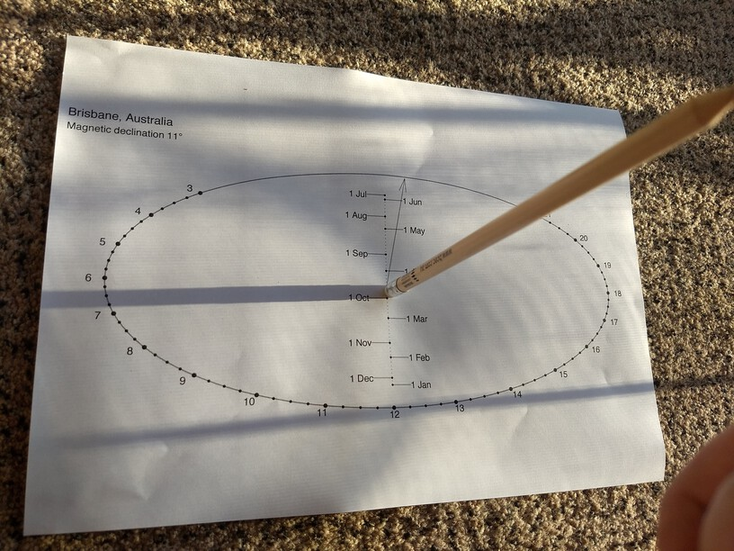

<!-- README.md is generated from README.Rmd. Please edit that file -->

```{r, include = FALSE}
knitr::opts_chunk$set(
  collapse = TRUE,
  comment = "#>",
  fig.path = "man/figures/README-",
  out.width = "100%", 
  fig.height = 6,
  fig.width  = 10
)
```
# analemmatic

<!-- badges: start -->

<!-- badges: end -->


The `analemmatic` package creates analemmatic sundials.

Given a city, `analemmatic` will get its latitude and [magnetic declination](https://en.wikipedia.org/wiki/Magnetic_declination)
from an internal dataset and use this to construct an [analemmatic sundial](https://en.wikipedia.org/wiki/Analemmatic_sundial).

Analemmatic sundials are neat because they are a flat (horizontal) sundial with a vertical gnomon. They are often scaled up
and uses as sculptures in parks such that the human standing in a specific location casts the shadow for the sundial.

The sundials output by this package include a marker for magnetic north to help you align them for local conditions.

## Installation

You can install from [GitHub](https://github.com/coolbutuseless/analemmatic) with:

``` r
# install.packages("remotes")
remotes::install_github("coolbutuseless/analemmatic")
```

This package stands on the shoulders of giants:

* [ggplot2](https://cran.r-project.org/package=ggplot2) - for all the plotting
* [ggforce](https://cran.r-project.org/package=ggforce) - for `geom_ellipse()`
* [oce](https://cran.r-project.org/package=oce) - for magnetic declination calculation
* [maps](https://cran.r-project.org/package=maps) - for lat/long data for 40k cities


## Example: An analemmatic sundial for Brisbane, Australia

```{r example, collapse = TRUE}
library(analemmatic)
# For manual plotting see `analemmatic:::cities` data.
# create_sundial(latitude = -27.5, magnetic_declination = 11) # Brisbane

create_sundial_for_city('Brisbane')
```


1. Print out the image
2. Use a compass to align the magnetic north arrow on the printed page with a compass
3. Place a tall, thin object (the gnomon) on the page such that it is positioned at the current date (this will take some
guesswork/eyeballing for any date which isn't the 1st of the month)
4. Read off the solar time from the shadow cast!

This is 6:30am in the middle of March in Brisbane, Australia




